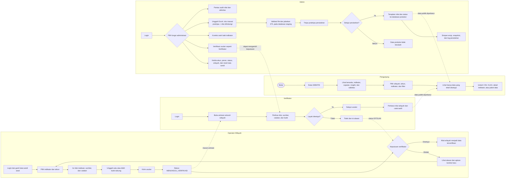
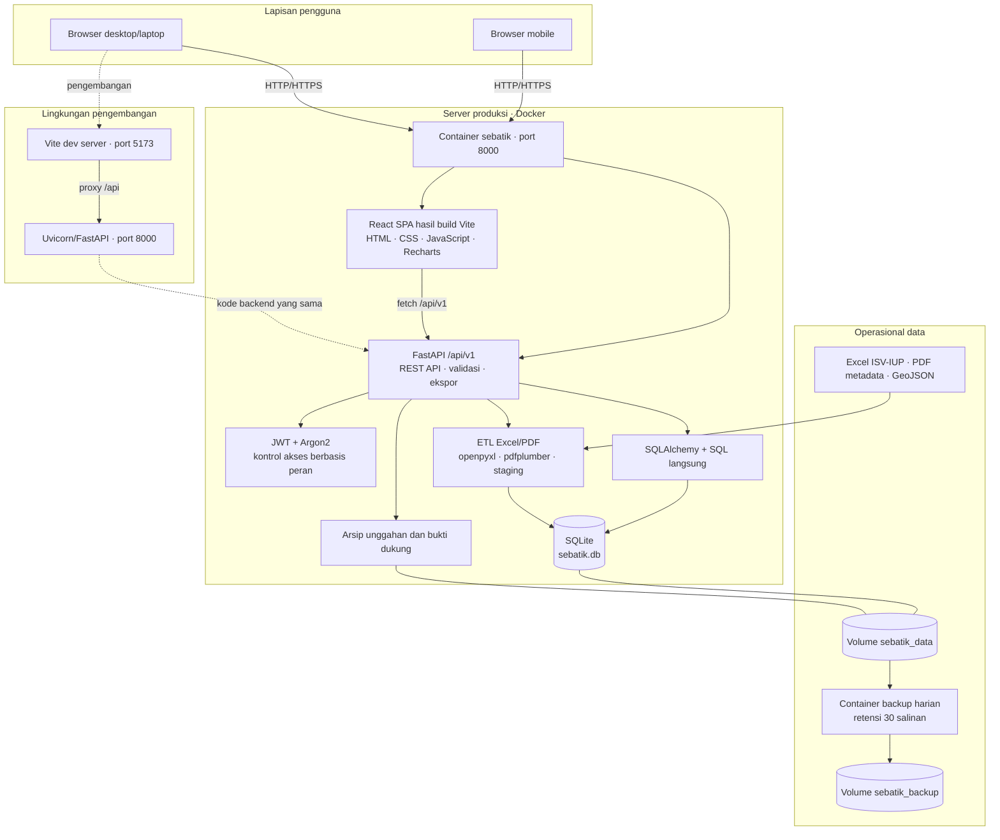
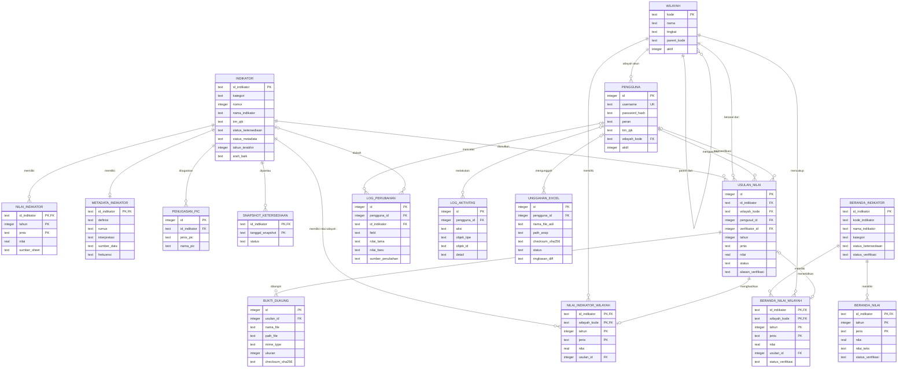

# Diagram Sistem SEBATIK

Dokumen ini menggambarkan implementasi SEBATIK saat ini berdasarkan alur pada frontend, endpoint FastAPI, proses ETL, dan skema `data/processed/sebatik.db`.

## 1. Proses bisnis berbasis peran

## 2. Arsitektur sistem

## 3. Diagram basis data

Diagram menampilkan seluruh tabel aplikasi. Atribut yang ditampilkan diprioritaskan pada primary key, foreign key, status, dan nilai bisnis agar relasi tetap terbaca.

### Catatan struktur data

- `indikator`, `nilai_indikator`, dan `metadata_indikator` adalah dataset utama hasil ETL.
- `usulan_nilai` menyimpan workflow; persetujuan menghasilkan atau memperbarui `nilai_indikator_wilayah` dan tampilan publik wilayah.
- `beranda_*` adalah tabel baca terverifikasi yang menyokong beranda dan explorer, termasuk nilai teks serta data wilayah.
- `bukti_dukung` menyimpan metadata berkas; isi berkas berada pada penyimpanan arsip, bukan sebagai BLOB di SQLite.
- `log_perubahan` merekam perubahan nilai/field, sedangkan `log_aktivitas` merekam tindakan administratif.
